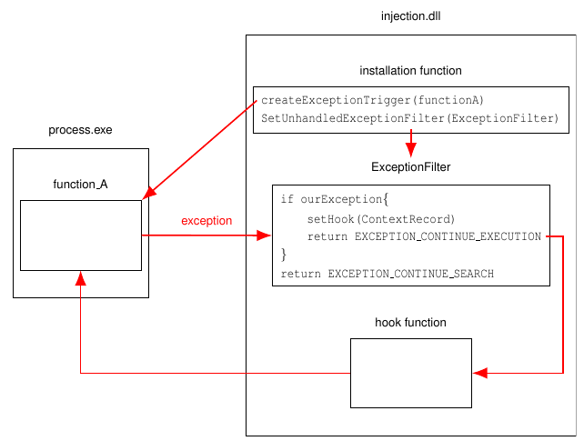
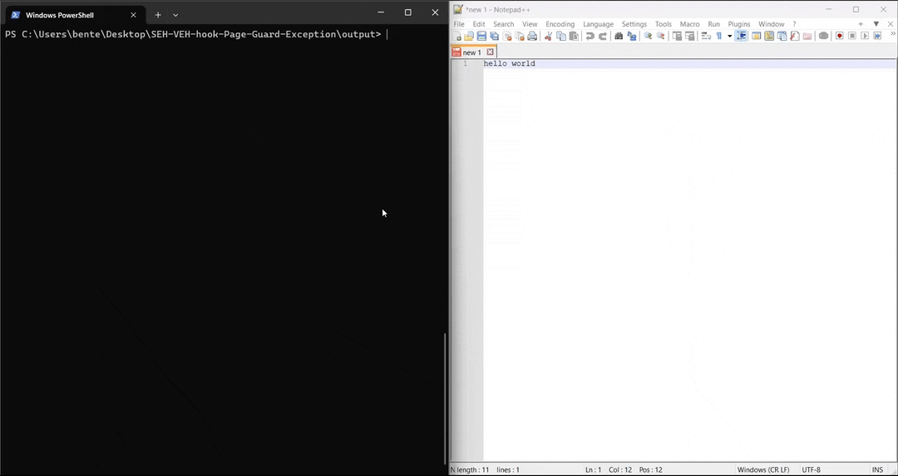

# Structered/Vectored Exception Handler hook

A demo of a Structured or Vectored Exception Handler (SEH/VEH) hook using a Page Guard Exception.

## Structured/Vectored Exception Handler

Structured Exception Handling (SEH) is a mechanism for handling both hardware and software exceptions.
This enables applications to have complete control over the handling of exceptions and provides support for debuggers.
Vectored Exception Handling is an extension to Structured Exception Handling.

When an exception is raised, a list of ExceptionFilters will be traversed until a handler for that particular exception is found.
Once the ExceptionFilter is finished handling the exception, it can return control to the rest of the application.

## SEH/VEH hook

To install a SEH hook, we will first inject the DLL in this project using a [DLL injector](https://github.com/BenteVE/DLL-Injector).
This DLL contains a hook function, an ExceptionFilter and an installation function.

To install the hook, we can use `SetUnhandledExceptionFilter` for an SEH hook or `SetVectoredExceptionHandler` for a VEH hook.
In both cases, the ExceptionFilter can be the same.

In this implementation we will add a `PAGE_GUARD` to the memory page that contains the original function to trigger the exception.
When a `STATUS_GUARD_PAGE_VIOLATION` is caught, we can check if the accessed address is the address of the target function.
If this is the case, we can change the instruction pointer in the `ContextRecord` to point to our hook function.
Once the ExceptionFilter is done, this will cause the program to continue from that function.



When a `STATUS_GUARD_PAGE_VIOLATION` is caught, the `PAGE_GUARD` is removed, so we need to reapply it at the end of the hook function.

There is an additional problem if the accessed address on the page is not caused by the target function.
In this case we will make sure the `PAGE_GUARD` stays applied by using `STATUS_SINGLE_STEP`.
This will cause another exception to be throw after executing a single instruction, at which point we can reapply the page guard.
Note that the program can be slowed down significantly when this happens frequently.

The triggering and recovering from the exceptions can be accomplished in multiple different ways.
For some alternative implementations of a SEH/VEH hook, you can view:

- [SEH/VEH hook triggering exception with INT3 opcode](https://github.com/BenteVE/SEH-VEH-hook-INT3-opcode)
- [SEH/VEH hook triggering exception with Debug Registers and recovering with an assembly trampoline](https://github.com/BenteVE/SEH-VEH-hook-Debug-Registers-Breakpoint)

## Demo

In this particular implementation, we will hook the `MessageBoxW` function in the `user32.dll`.
The hook function will simply call the original function with a modified argument to replace the title.

1. Clone the repository:

    ```bash
    git clone https://github.com/BenteVE/SEH-VEH-hook-Page-Guard-Exception.git
    ```

2. Build the DLL for the desired architecture (x86 or x64) using Visual Studio.
   The architecture of the DLL should match the architecture of the target program and the used DLL injector.

3. Use a DLL injector to inject the built DLL into the target process.
   The injector used here is available in another [repository](https://github.com/BenteVE/DLL-Injector) with a detailed explanation.

4. Trigger an action that uses a `MessageBox` in the target program to verify that the hook worked.
   For Notepad++, attempting to close an unsaved file does this:

    
